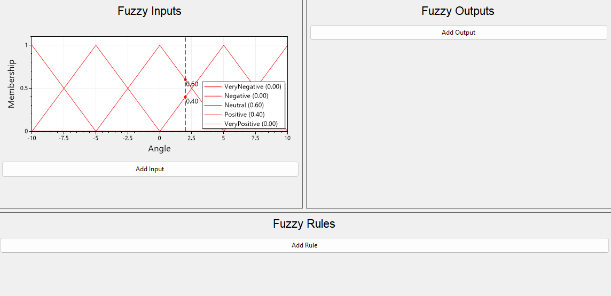

## Overview

FluentFuzzy is a .NET package for adding fuzzy logic to a project in an easily readable, fluent way. The project is freely available [on Github](https://github.com/OliverVea/FluentFuzzy).

I've written an introductory article on fuzzy logic [here](../fuzzy-logic), which explains the basic concept and how it works.

The project includes four source projects and a test project.

The [FluentFuzzy](https://github.com/OliverVea/FluentFuzzy/tree/main/src/FluentFuzzy) project contains the code for the core logic and fluent syntax builder of the package. It has several membership functions, which allow the user to specify exactly how they want the fuzzy system to behave. It's written in a way that allows the user to implement their own membership functions if desired, allowing the user to tailor the package to their needs.

The [FluentFuzzy.Visualizer](https://github.com/OliverVea/FluentFuzzy/tree/main/src/FluentFuzzy.Visualizer) project contains code for constructing and visualizing a fuzzy system, as seen in the picture below.



The [FluentFuzzy.Unity](https://github.com/OliverVea/FluentFuzzy/tree/main/src/FluentFuzzy.Unity) and [FluentFuzzy.Unity.Editor](https://github.com/OliverVea/FluentFuzzy/tree/main/src/FluentFuzzy.Unity.Editor) projects have code for integrating with Unity, with the former project containing the runtime logic and the latter project containing the editor logic. It allows for using a [Unity Curve](https://docs.unity3d.com/Manual/EditingCurves.html) as a membership function and editing it directly in the Unity UI.

Lastly, the [FluentFuzzy.Test](https://github.com/OliverVea/FluentFuzzy/tree/main/test/FluentFuzzy.Test) project has an example of the fuzzy logic. This example is used in the [README.md](https://github.com/OliverVea/FluentFuzzy/blob/main/README.md) file, and is verified in the `CI` step [`verify-example`](https://github.com/OliverVea/FluentFuzzy/blob/main/.github/workflows/test.yml#L16C2-L16C2).

A nuget package is created whenever code is merged to the `main` branch, but as the project is currently WIP, the nuget package is private. To use the module, please clone the repository and use the source code directly.

## Using FluentFuzzy

The syntax when using FluentFuzzy is very simple and natural. Firstly, the fuzzy inputs and outputs are created. The `FuzzyInput` uses a delegate to sample the current value. This value might be retrieved from the game, from a sensor, from the database or it might be regularly cached for performance.

```cs
const int angleValue = 7;
FuzzyInput angle = new(() => angleValue);
FuzzyOutput torque = new();
```

The membership functions can then be set. The `const int` values are simply identifiers for the membership functions. They can be named so they are easily identifiable. The membership functions are the same as in the [example](../fuzzy-logic#what-is-fuzzy-logic) from the earlier article.

```cs
const int veryNegative = 0;
const int negative = 1;
const int neutral = 2;
const int positive = 3;
const int veryPositive = 4;

angle.Set(veryNegative, new Line(-5, -10));
angle.Set(negative, new Triangle(-10, -5, 0));
angle.Set(neutral, new Triangle(-5, 0, 5));
angle.Set(positive, new Triangle(0, 5, 10));
angle.Set(veryPositive, new Line(5, 10));
```

Similarly, the membership functions for the `torque` fuzzy output are set.

```cs
torque.Set(veryNegative, new Triangle(-150, -100, -50));
torque.Set(negative, new Triangle(-100, -50, 0));
torque.Set(neutral, new Triangle(-50, 0, 50));
torque.Set(positive, new Triangle(0, 50, 100));
torque.Set(veryPositive, new Triangle(50, 100, 150));
```

The rulebase is built, mapping the input `angle` parameter to the output `torque` parameter. Note the very natural and readable syntax for the fuzzy rulebase.

```cs
FuzzyRule.If(angle.Is(veryNegative)).Then(torque.Is(veryNegative));
FuzzyRule.If(angle.Is(negative)).Then(torque.Is(negative));
FuzzyRule.If(angle.Is(neutral)).Then(torque.Is(neutral));
FuzzyRule.If(angle.Is(positive)).Then(torque.Is(positive));
FuzzyRule.If(angle.Is(veryPositive)).Then(torque.Is(veryPositive));
```

Lastly, the output can be evaluated. As this code is part of a unit test, the error is compared to a tolerance of `0.01`.

```cs
const float tolerance = 0.01f;
const double expected = 70;
var torqueValue = torque.Evaluate();
var error = Math.Abs(torqueValue - expected);
Assert.That(error, Is.LessThan(tolerance));
```

The eagle eyed reader might have noticed that the resulting value is different to the one in the previous article. This is because the defuzzyfication is done slightly different from the centroid method. Here, the centroid of each output is computed seperately and then summed.

For standard centroid defuzzification, the overlap of methods do not contribute to the centroid. This means that the values vary slightly. This way of computing the centroid allow for easier implementation of membership functions and quicker evaluation.

## Conclusion

As seen in the code above, the fuzzy logic works as expected. The package is easily integrated into almost any .NET project, so please give it a try!

For any issues, feel free to reach out.

Happy coding!