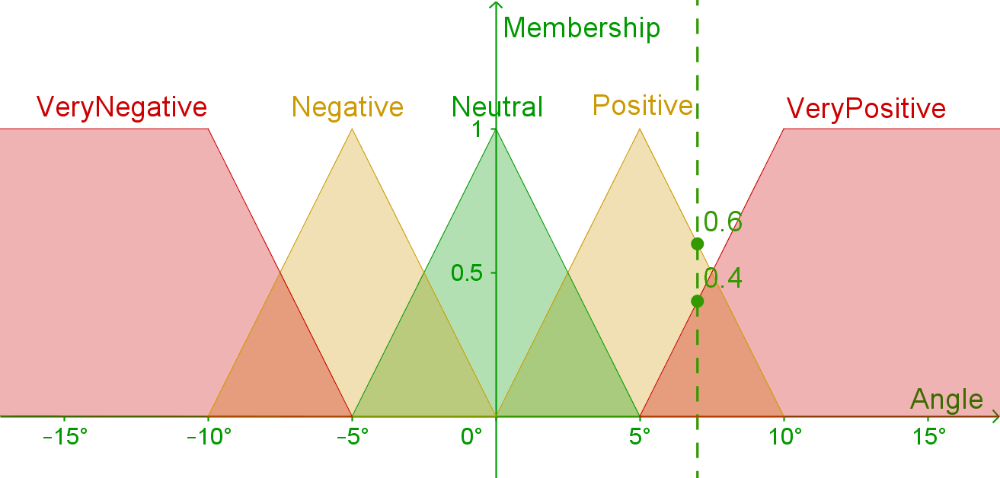

## Introduction

As part of developing my dungeon-based RPG, I've recently been tinkering with fuzzy logic as a way to transform what non-player agents observe into what actions they choose to perform.

The benefit of using fuzzy logic in this way is that given a set of input parameters, I can make human-understandable and -interpretable rules which can result in a very complex output.

I haven't yet integrated fuzzy logic into my game, but I thought I would make an explanatory article, which I can follow up with an update on my side-project afterwards.

## What is fuzzy logic

Fuzzy logic is a type of logic which can be used for e.g. [control](https://www.sciencedirect.com/science/article/abs/pii/S0020737380800502) and [prediction](https://www.iaeng.org/publication/WCECS2008/WCECS2008_pp804-809.pdf). It works by taking an input, fuzzifying it with membership functions, applying a rule base of fuzzy rules to calculate the outputs which can then be defuzzified.

For example, to balance an inverted pendulum, there might be one single input: the pendulum angle. Let's say that the pendulum is in it's neutral state when it's pointing directly up. Any position of the pendulum can be compared to the neutral state to get the angular error.

This error will be our input. Let's say that an angle of 0° is `Neutral`, 5° is `Positive`, -5° is `Negative`, anything 10° or above is `VeryPositive`, and anything -10° or below is `VeryNegative`.  We can then choose membership functions that assign a membership value to each function depending on the input.

For example, a value of 7° will have a value of `Positive = 0.6`, `VeryPositive = 0.4` and other values will simply be zero.

To balance the inverted pendulum, we want to set the PWM pulse width of the motor control to control the torque of the motor. As the objective is for the pendulum to stay upright, we want to counteract any angular error. This means that for a `Negative` angle, we want to move underneath the pendulum, in the `Negative` direction by setting the motor to `Negative` torque. For a `Positive` angle we move with `Positive` torque. We can also have higher torque values for `VeryPositive` and `VeryNegative` torques.

Membership functions can be assigned to the output parameter torque, for each of these.

The last step is to connect the input parameters to the output parameter with fuzzy rules. Fuzzy rules are logical statements that allows for calculating the outputs, based on the input. For example the fuzzy rules for the inverted pendulum could be:

- `if Angle is VeryPositive then Torque is VeryPositive`
- `if Angle is Positive then Torque is Positive`
- `if Angle is Neutral then Torque is Neutral`
- `if Angle is Negative then Torque is Negative`
- `if Angle is VeryNegative then Torque is VeryNegative`

To compute the Torque from a given Angle, all of the input membership functions are evaluated on the Angle. This is a process known as fuzzyfication.

Then the output memberships are calculated from the input memberships according to the fuzzy rules.

Lastly, the output memberships are converted into a single output value. This process is called defuzzyfication. A common way to do this is to calculate the centroid of the shape of the output membership functions.

For the example of 7°, there are two non-zero memberships; `Positive = 0.6` and `VeryPositive = 0.4`. A shape can then be constructed as follows.

Then the centroid of the shape is calculated, `Torque = 71.29%`, which is the output of the fuzzy system.

## Conclusion

I'll be developing a small .NET package for implementing fuzzy systems in e.g. Unity projects. I'll make sure to attach a link here when it is ready.

__Update__: The article on FluentFuzzy can be found [here](../fluent-fuzzy).